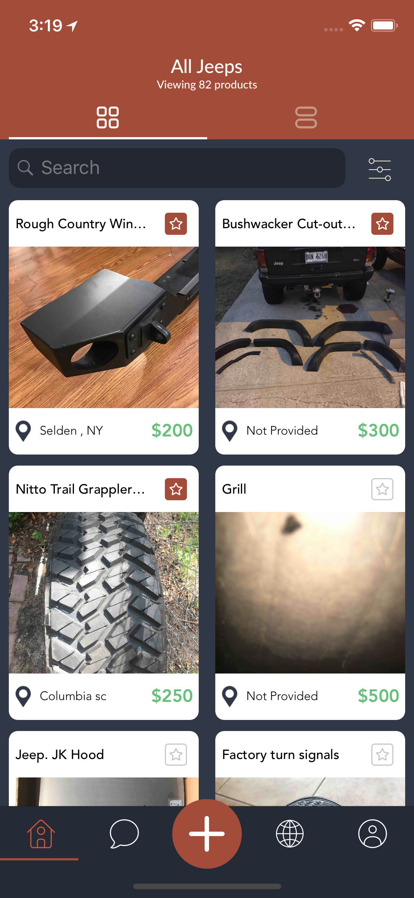
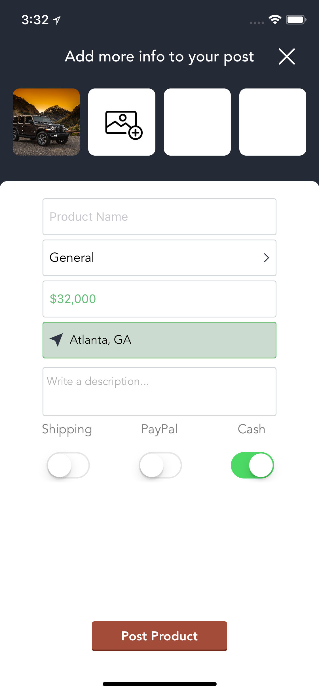
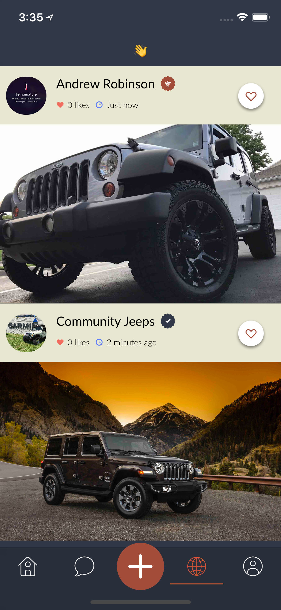
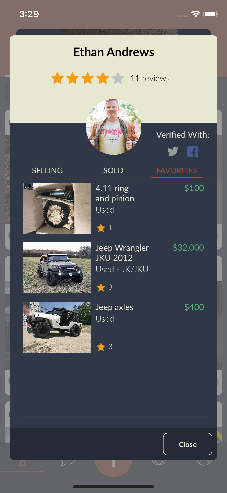
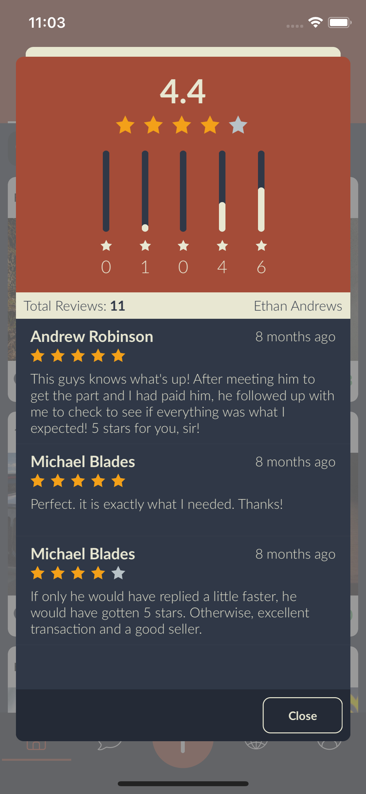

  

# Features
* Look for Jeep parts anywhere in the world. :earth_americas:
* Sign up for an account to post your own jeep parts. :family:
* Favorites parts to save them for later. :star:
* Message another part owner if you're interested. :beers:
* Show off your new part on the social area. :wave:

# How to build
### Requirement
* Xcode 9.2

### Process
1. If you don't already have one, create a Firebase project.
2. Download the `GoogleService-Info.plist`
3. Paste the `.plist` into `The Wave/` folder.
4. Open `The Wave.xcworkspace`.
5. Build and run!

# Preview

  
  

  
  

  

# Thanks!
* This project was made for the Jeep fans out there. O|||||||O
* Here is a link to it on the App Store: [The Wave - A Jeep Marketplace](https://itunes.apple.com/us/app/the-wave-a-jeep-marketplace/id1260803629?ls=1&mt=8)
* Thanks for checking it out!

  Made with ❤️ by 

